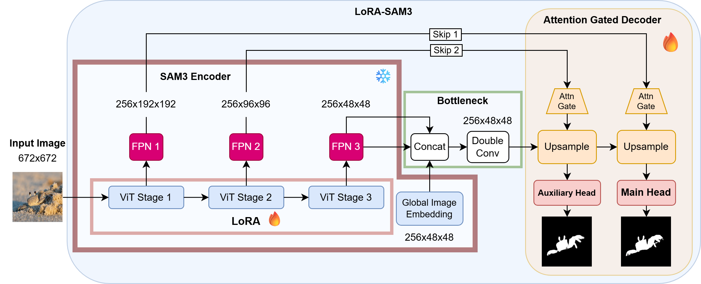

# LoRA-SAM3: Anonymous GitHub Repository

> **Anonymous Submission** 
> Paper ID: 1306

This is the official PyTorch implementation for our submission: **LoRA-SAM3**. We propose a highly efficient and effective framework that adapts the frozen Segment Anything Model 3 (SAM3) using Low-Rank Adaptation (LoRA) and a lightweight Attention Gated (AttGate) decoder.

Our method achieves **State-of-the-Art (SOTA)** performance across 11 datasets spanning Salient Object Detection (SOD), Camouflaged Object Detection (COD), and Marine Animal Segmentation (MAS).

  

*Note: This repository has been carefully anonymized for double-blind peer review. Full pre-trained weights, ArXiv links, and author details will be released upon de-anonymization.*

---

## 🚀 Key Features

* **Parameter Efficient:** Achieves SOTA results by training only ~6.4M parameters while keeping the heavy SAM3 encoder completely frozen.
* **Attention Gated Decoder:** Replaces the standard U-Net decoder with an `AttGate` decoder to better fuse multi-scale features, yielding higher $S_m$ scores without significantly increasing GMACs or latency.
* **Universal Application:** Consistently outperforms recent specialized models on SOD, COD, and MAS tasks.

---

## 📊 Quantitative Results

Our model ($r=8$ AttGate) sets new SOTA benchmarks. Below is a subset of our results on Camouflaged Object Detection (COD) datasets.

| Methods | CAMO ($S_m\uparrow$) | COD10K ($S_m\uparrow$) | CHAMELEON ($S_m\uparrow$) | NC4K ($S_m\uparrow$) |
|:---|:---:|:---:|:---:|:---:|
| ZoomNeXt (2024) | 0.889 | 0.898 | 0.924 | 0.903 |
| BiRefNet (2024) | 0.904 | 0.913 | 0.932 | 0.914 |
| SAM2-UNet (2026)| 0.884 | 0.880 | 0.914 | 0.901 |
| **LoRA-SAM3 (Ours)** | **0.926** | **0.927** | **0.942** | **0.930** |

> *For full results across all 11 datasets (including SOD and MAS) and detailed efficiency ablations, please refer to the main paper.*

---

TODO
## 🛠️ Installation

